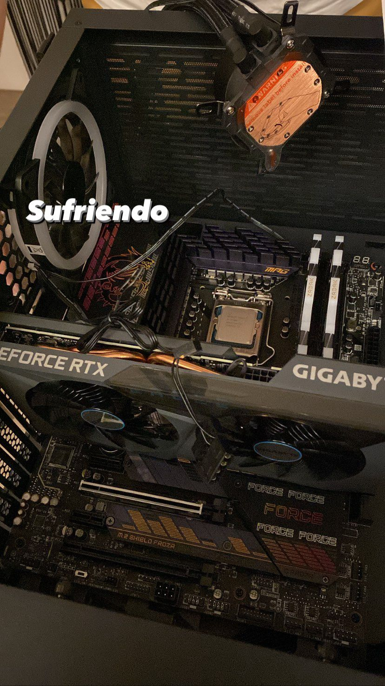
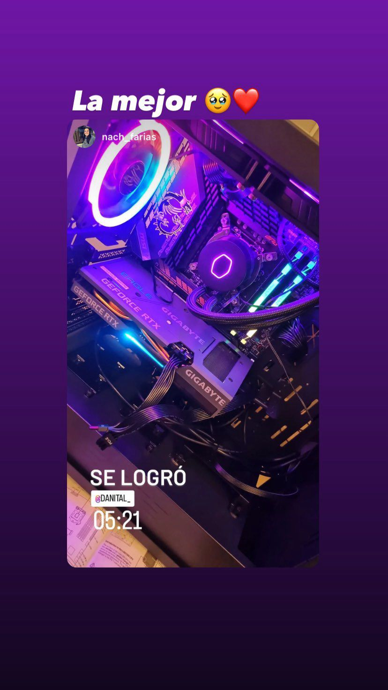

# 🖥️ Custom PC Build for Client

Proyecto de ensamblaje y configuración de un computador personalizado para cliente, documentando el proceso técnico completo.

---

## 📌 Overview

Este proyecto muestra el proceso de armado de un PC desde cero, incluyendo instalación de hardware, refrigeración líquida, gestión de cables y resolución de problemas.

---

## 🧩 Hardware

- CPU: Intel Core i5-11400F  
- GPU: RTX 3060  
- RAM: 16GB DDR4  
- Motherboard: Z590  
- Storage: SSD + HDD  
- PSU: 650W  
- Cooling: AIO 240mm  

---

## 🔧 Build Process

### Instalación de componentes

- Instalación de CPU y RAM  
- Preparación de la placa madre  

---

## 🧪 Troubleshooting

**Problema:** Dificultad en instalación del sistema de refrigeración  
**Solución:** Reorganización de componentes y ajuste del cooler  

---

## ✅ Final Result

- Sistema funcional  
- Buen manejo térmico  
- Cableado optimizado  

---

## 🎥 Build Video

Video corto del resultado final del armado (5 segundos):

[Ver video](https://raw.githubusercontent.com/Ifarf/pc-build-client-project/main/media/build.mp4)

---

## 🧠 Skills Demonstrated

- Hardware Assembly  
- Troubleshooting  
- Cable Management  
- Thermal Management  
- System Setup  

---

## 📈 Future Improvements

- Upgrade a NVMe SSD  
- Optimización de airflow
